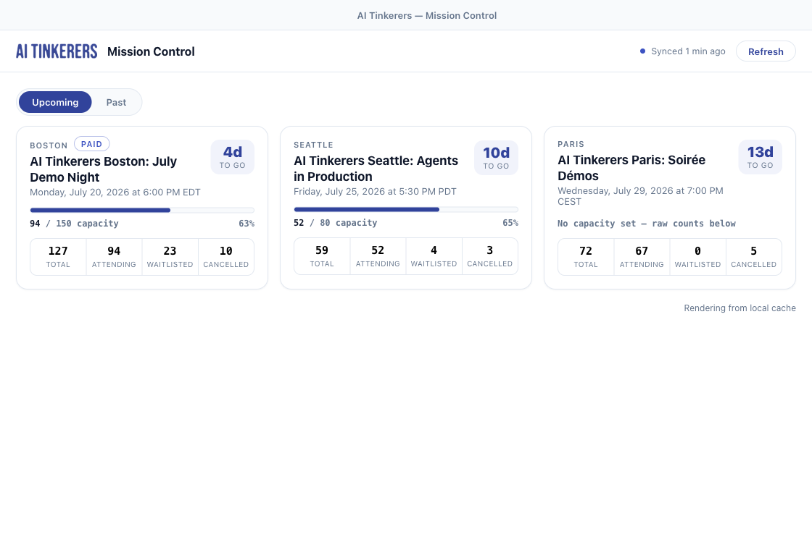
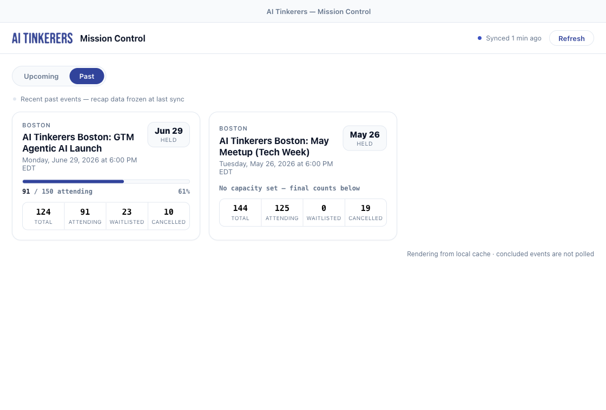
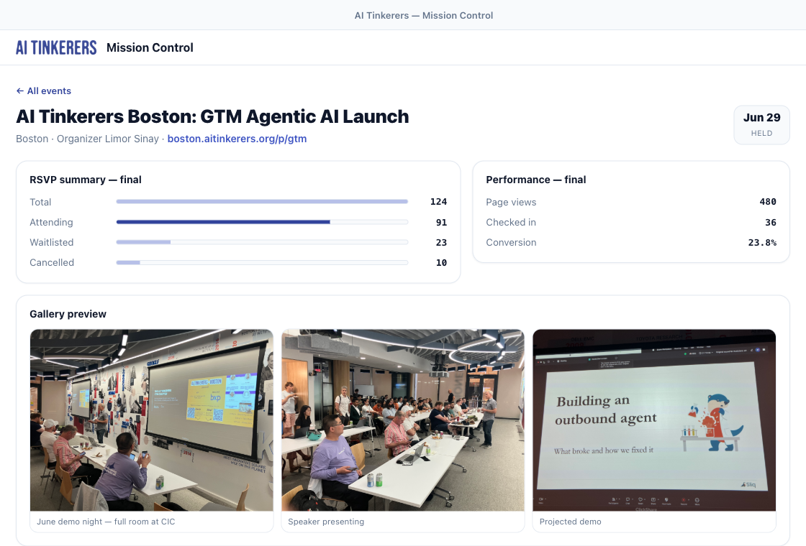

# AI Tinkerers — Event Mission Control

A native macOS (Tauri) desktop app that gives AI Tinkerers city organizers an
ambient, always-current view of their upcoming events: RSVP funnels, capacity,
awaiting-payment stragglers, performance, and a menubar widget with live counts
and change notifications. Built on the [AI Tinkerers Agents API](https://aitinkerers.org/api/agents/v1/openapi.yaml).

## Screenshots

**Events overview** — upcoming events with RSVP funnel, capacity gauge, and countdown:



**Past tab** — concluded events with held-date recap and final counts:



**Event detail** — RSVP summary, performance (page views / real check-ins / conversion), and gallery:



> Screenshots use representative sample data.

## Stack

- **Tauri 2** native shell (Rust) — owns keychain, HTTP, SQLite cache, poll scheduler, tray.
- **TypeScript + Vite** frontend (no UI framework) — renders exclusively from the local cache.
- Visual language ported from `design/` (see `design/DESIGN.md` — the source of truth).

TypeScript is the language; **Vite** is the bundler/dev server that compiles and
serves it inside the Tauri webview. They are layered, not alternatives.

## Prerequisites

- [bun](https://bun.sh), Rust toolchain, and the Tauri system deps.

## Run

```bash
bun install
bun run refresh-openapi   # vendor the OpenAPI spec + regenerate types (optional)
bun tauri dev             # launch the app (Vite dev server on port 1425)
```

The dev server uses **port 1425** (HMR 1426) to avoid clashing with other local
Tauri apps that default to 1420.

## Architecture

- `src-tauri/src/api.rs` — API client: Bearer auth, envelope unwrap, typed errors, rate headers.
- `src-tauri/src/keychain.rs` — API key stored only in the OS keychain.
- `src-tauri/src/db.rs` — SQLite cache (`events`, `rsvp_summaries`, `awaiting_payment`, `performance_snapshots`, `sync_state`).
- `src-tauri/src/sync.rs` — poll scheduler, poll-diff notifications, tray updates, rate-limit backoff.
- `src-tauri/src/commands.rs` — Tauri commands bridging the frontend.
- `src/` — TypeScript UI: `screens/onboarding.ts`, `screens/overview.ts`, `screens/detail.ts`, `popover.ts`.

The frontend never calls the network directly — all API access and caching live
in Rust, so the UI renders offline from SQLite and the app stays within the
API's per-key rate limits.

## Spec

This app was built from the OpenSpec change `add-event-mission-control-v1`
(`openspec/changes/add-event-mission-control-v1/`): proposal, design, five
capability specs, and the task checklist.
