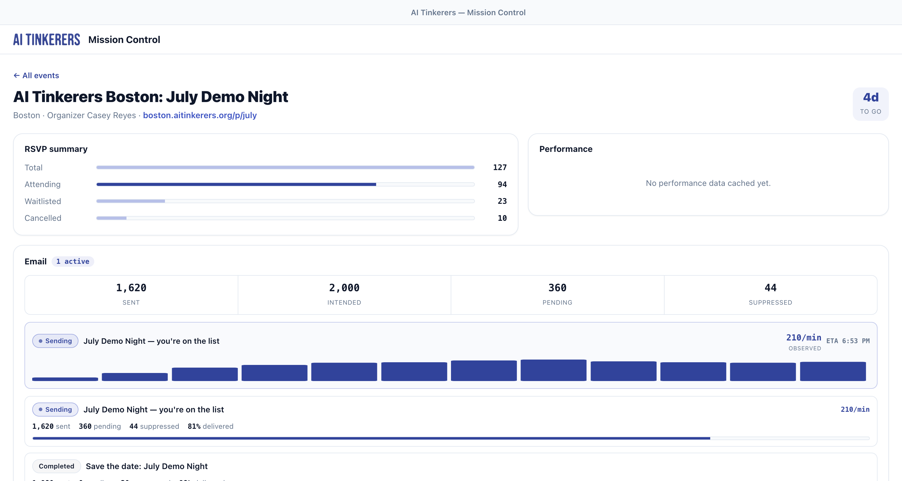
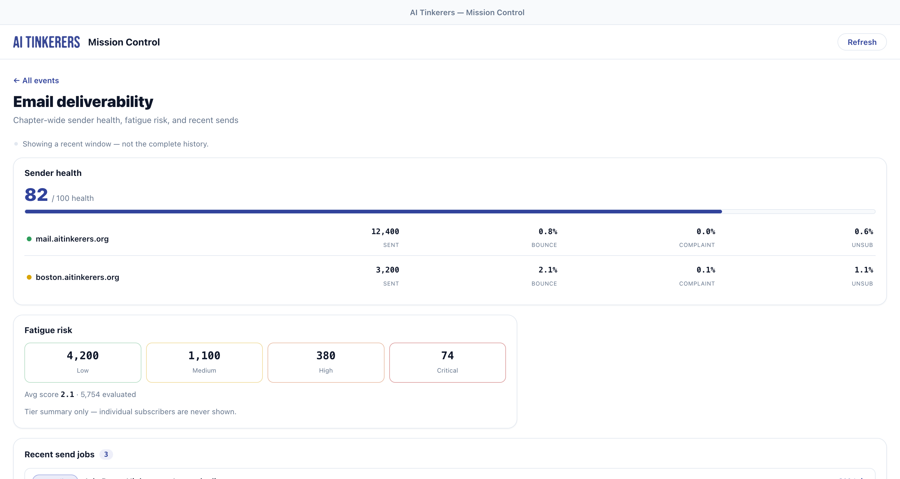

# AI Tinkerers — Event Mission Control

A native macOS (Tauri) desktop app that gives AI Tinkerers city organizers an
ambient, always-current view of their upcoming events: RSVP funnels, capacity,
awaiting-payment stragglers, performance, and a menubar widget with live counts
and change notifications. Built on the [AI Tinkerers Agents API](https://aitinkerers.org/api/agents/v1/openapi.yaml).

## Screenshots

**Events overview** — upcoming events with RSVP funnel, capacity gauge, and countdown:


**Past tab** — concluded events with held-date recap and final counts:


**Event detail** — RSVP summary, performance (page views / real check-ins / conversion), and gallery:


**Per-event email** — send-job delivery accounting, live active-send throughput, and open/click performance:



**Chapter email deliverability** — sender-domain health, fatigue-risk tiers, and recent sends:



> Screenshots use representative sample data.

## Stack

- **Tauri 2** native shell (Rust) — owns keychain, HTTP, SQLite cache, poll scheduler, tray.
- **TypeScript + Vite** frontend (no UI framework) — renders exclusively from the local cache.
- Visual language ported from `design/` (see `design/DESIGN.md` — the source of truth).

TypeScript is the language; **Vite** is the bundler/dev server that compiles and
serves it inside the Tauri webview. They are layered, not alternatives.

## Prerequisites

- [bun](https://bun.sh), Rust toolchain, and the Tauri system deps.

## Run

```bash
bun install
bun run refresh-openapi   # vendor the OpenAPI spec + regenerate types (optional)
bun tauri dev             # launch the app (Vite dev server on port 1425)
```

The dev server uses **port 1425** (HMR 1426) to avoid clashing with other local
Tauri apps that default to 1420.

> **Dev-build keychain prompts:** `bun tauri dev` produces an *unsigned, constantly
> rebuilt* binary. macOS keychain "Always Allow" trusts a specific code signature,
> so each rebuild is a new identity and the prompt (and re-onboarding) returns.
> This is expected in dev — a **signed** release build (below) has a stable
> identity, so you allow it once and it sticks.

## Building & distributing (macOS)

Distributing without the "app is damaged / right-click → Open" friction requires
a **code-signed + notarized** build. That needs:

1. **Apple Developer Program** membership (paid).
2. A **Developer ID Application** certificate in your login keychain
   (Xcode → Settings → Accounts → *team* → Manage Certificates → **+** → *Developer ID Application*).
3. A notarization credential — an **app-specific password**
   ([account.apple.com](https://account.apple.com) → Sign-In and Security →
   App-Specific Passwords) or an **App Store Connect API key**.

Then build with the helper script (it auto-detects your Developer ID cert):

```bash
# Notarized build — set your notarization credentials first:
export APPLE_ID="you@example.com"
export APPLE_PASSWORD="app-specific-password"
export APPLE_TEAM_ID="YA3FM9C24T"
bash scripts/build-macos.sh          # signs, notarizes, staples → .dmg
```

Without the notarization vars, `bash scripts/build-macos.sh` still produces a
**signed** build (fixes the dev keychain-prompt issue on your own Mac) — it just
isn't notarized, so other people would still need the workaround.

Artifacts land under `src-tauri/target/release/bundle/` (`macos/*.app`,
`dmg/*.dmg`). Verify:

```bash
spctl -a -vvv -t install "src-tauri/target/release/bundle/macos/AIT Mission Control.app"
# notarized → "accepted — source=Notarized Developer ID"
```

> The DMG step runs an AppleScript that needs an interactive GUI session — run
> the build in your own Terminal (not a headless/CI shell) for the `.dmg`, or
> pass `--bundles app` to ship just the `.app`.

## Architecture

- `src-tauri/src/api.rs` — API client: Bearer auth, envelope unwrap, typed errors, rate headers.
- `src-tauri/src/keychain.rs` — API key stored only in the OS keychain.
- `src-tauri/src/db.rs` — SQLite cache (`events`, `rsvp_summaries`, `awaiting_payment`, `performance_snapshots`, `sync_state`).
- `src-tauri/src/sync.rs` — poll scheduler, poll-diff notifications, tray updates, rate-limit backoff.
- `src-tauri/src/commands.rs` — Tauri commands bridging the frontend.
- `src/` — TypeScript UI: `screens/onboarding.ts`, `screens/overview.ts`, `screens/detail.ts`, `popover.ts`.

The frontend never calls the network directly — all API access and caching live
in Rust, so the UI renders offline from SQLite and the app stays within the
API's per-key rate limits.

## Spec

This app was built from the OpenSpec change `add-event-mission-control-v1`
(`openspec/changes/add-event-mission-control-v1/`): proposal, design, five
capability specs, and the task checklist.
